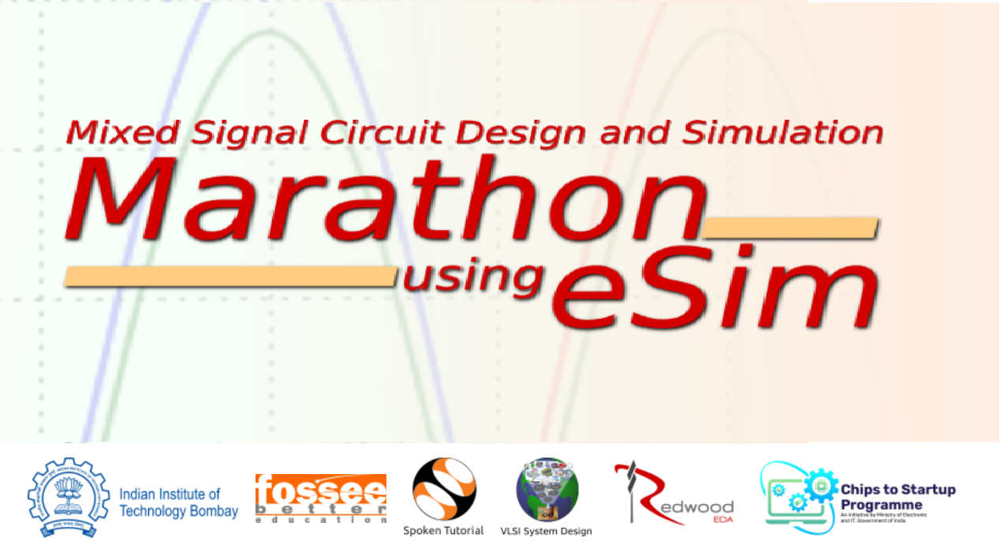
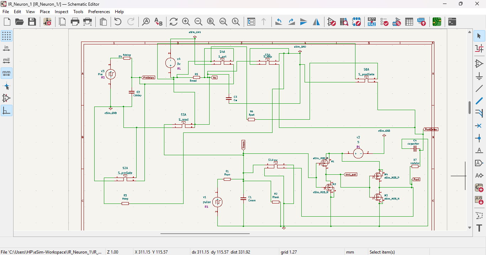
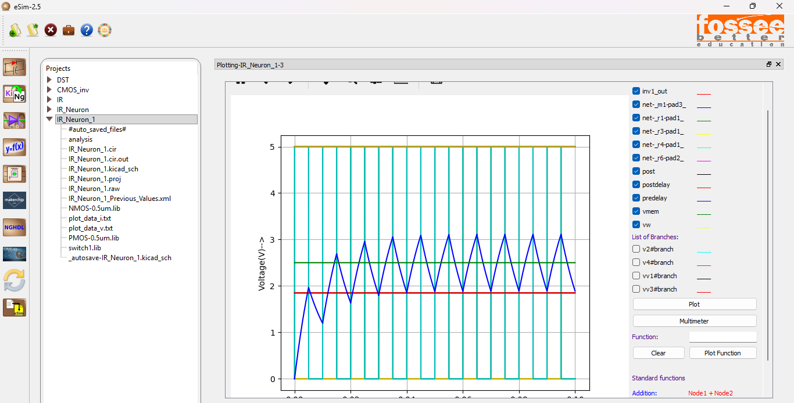

<h2 style="color:#1d3557; font-size:28px;">🧠 Neuromorphic Circuit Design: Integrate-and-Fire Neuron with STDP Synapse</h2>

This project focuses on designing and simulating a neuromorphic circuit that mimics the behavior of biological neurons and synapses. It implements an Integrate-and-Fire (I&F) neuron with aSpike-Timing-Dependent Plasticity (STDP) synapse using eSim and Ngspice, demonstrating brain-inspired learning mechanisms. 

##  📋Table of Contents

1. Abstract
2. Objective
3. Description
4. Software-and-Tools-Used
5. Circuit-Diagram
6. Simulation-Results
7. Conclusion
8. Future Scope
9. GitHub-Repository-Link
10. License-and-Reference
11.Author

---
 

## 1. 🧾Abstract
This project demonstrates a neuromorphic circuit that mimics the spiking and learning behavior of biological neurons.  
- An Integrate-and-Fire (I&F) neuron with a Spike-Timing-Dependent Plasticity (STDP) synapse is designed and simulated using eSim and Ngspice.  
- The circuit produces neuron-like spikes and adaptive synaptic responses, showcasing the potential of neuromorphic hardware for brain-inspired computation.
---
## 2. 🎯Objective
The main objective of this project is to design and simulate a neuromorphic circuit that mimics the biological learning and spiking mechanisms of neurons.  
Specifically, the goal is to:
- Implement an Integrate-and-Fire neuron that integrates input signals and generates spikes when the threshold is reached.  
- Design a Spike-Timing-Dependent Plasticity (STDP) synapse that adjusts synaptic weight based on the relative timing of pre- and post-synaptic spikes.  
- Validate the design using eSim and Ngspice simulations to observe neuron-like firing and adaptive learning behavior.

---

## 3.🧠Description
The neuromorphic circuit consists of two main sub-blocks:
1. **STDP Synapse** – Modulates the synaptic weight based on the time difference between pre- and post-synaptic spikes. It uses MOSFET switches and capacitors to store and update the synaptic strength.  
2. **Integrate-and-Fire Neuron** – Integrates the input current on a membrane capacitor. When the voltage exceeds a threshold, the neuron fires an output spike and resets the membrane potential.
3.The STDP synapse and neuron together emulate a simplified model of biological neural learning, showing spike-driven plasticity behavior.

---

## 4.🧰Software and Tools Used
- **eSim (by FOSSEE, IIT Bombay)** – for schematic design and circuit simulation.  
- **Ngspice** – for transient and analog simulations.  
- **KiCad** – for schematic editing.  
- **GitHub** – for version control and documentation.

- 

---

## 5.🧩Circuit Diagram

---

## 6.⚡Simulation Results

The Ngspice simulation demonstrates the expected integrate-and-fire neuron behavior and shows how the STDP synapse modifies its weight based on spike timing.

## 7.🧾Conclusion
The designed neuromorphic circuit successfully models integrate-and-fire neuron behavior with adaptive synaptic learning using STDP.  
This confirms the potential of eSim and Ngspice as effective open-source tools for neuromorphic circuit exploration.  
The project serves as a base for future research in low-power, brain-inspired VLSI design.

---

## 8.🔮 Future Scope 
The project can be further extended in several ways:
- Implement multiple interconnected neurons to form a small spiking neural network (SNN).  
- Integrate memristor-based synapses for realistic analog learning behavior.  
- Develop FPGA or ASIC implementations for hardware acceleration.  
- Explore real-time sensory input (e.g., vision or sound) for neuromorphic perception.  
- Optimize power and area for low-power edge-AI applications.

---

## 9.🔗GitHub Repository Link
[https://github.com/sana20041/NeuromorphicNeuron_eSim](https://github.com/sana20041/NeuromorphicNeuron_eSim)

---
## 10.📜License and References
- This project is released under the **GNU General Public License v3.0 (GPLv3)**.  
- References:  
  1. eSim FOSSEE Project – [https://esim.fossee.in](https://esim.fossee.in)  
  2. Mead, C. “Neuromorphic Electronic Systems,” *Proceedings of the IEEE*, 1990.
---

 
## 11.👩‍💻Author
**Sana**  
Department of Electronics and Communication Engineering  
BVRIT Hyderabad College of Engineering for Women  
📧 *Sana20041712@gmail.com*

